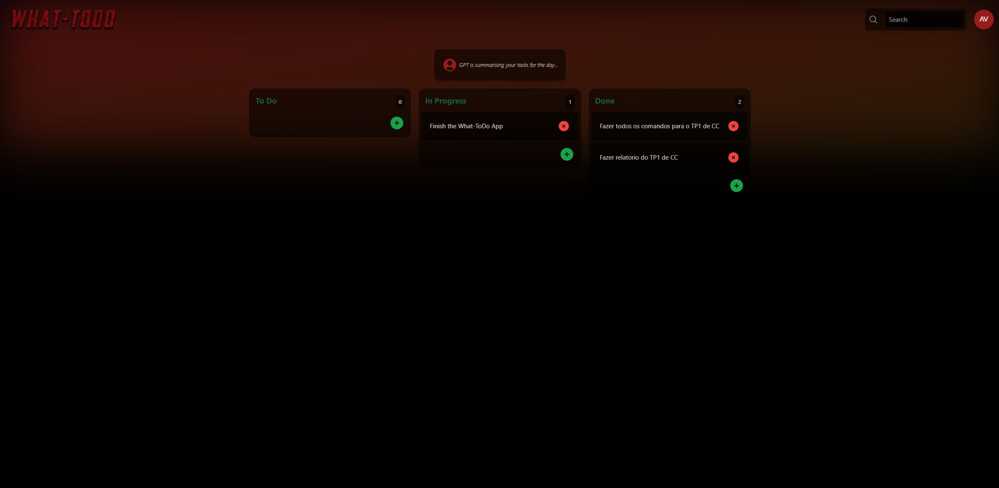

# What-Todo

Keep track of your tasks and know What-Todo

## Run

Rename `.env.local.EXAMPLE` to `.env.local` and paste their your API keys for Appwrite and OpenAI-API then you can run with:

```bash
npm run dev
```

## Preview


